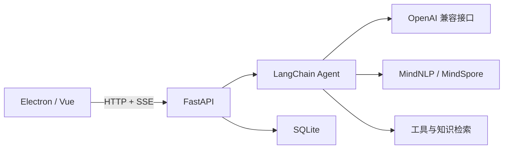

# MindPilot

支持本地模型、知识检索和实时执行时间线的桌面 Agent 应用。

[English](README.md) · [中文](README-zh.md)


示例展示一个长程任务：读取内部需求、检索研究资料和模型文档、计算部署预算、核查矛盾并整理验收清单。

## 功能

- **桌面工作区**：Electron、Vue、TypeScript；管理 Agent、会话、模型配置和知识库。
- **实时执行**：通过 SSE 显示模型输出、工具输入、执行结果和完成状态；连接中断和执行错误直接显示在会话中。
- **统一 Agent 流程**：在线与本地模型共用 LangChain structured-chat agent 和用户选择的工具。
- **中文知识库**：文档加载、中文文本处理、BM25 与向量检索；SQLite 保存会话和结果。
- **工具**：本地知识检索、arXiv、网页搜索、计算器、shell、天气与 Wolfram，按任务选择。

## 结构



## 启动

使用 Python 3.11、Node.js 20。后端和前端分别运行。

```bash
git clone https://github.com/fanxing-6/MindPilot.git
cd MindPilot
python -m venv .venv
```

激活环境：macOS/Linux 使用 `source .venv/bin/activate`；PowerShell 使用 `.venv\Scripts\Activate.ps1`。macOS 通过 Homebrew 安装 `libmagic`，Linux 安装系统的 `libmagic` 软件包，用于文档类型识别。

```bash
python -m pip install -r requirements.txt
cd src/mindpilot
python main.py
```

在仓库根目录打开另一个终端：

```bash
cd Frontend
npx yarn@1.22.22 install --frozen-lockfile
npm run dev
```

后端地址为 `127.0.0.1:7861`。打开「模型配置」，建立模型配置，再选择 Agent 与工具。在线配置填写 OpenAI 兼容接口地址、模型名称和 API key。

## 本地模型

在支持目标设备的 MindSpore 2.4 环境中安装 `requirements-local.txt`，模型平台选择 **Local**。

Linux x86_64、Python 3.11 的 MindSpore 2.4.0 安装命令：

```bash
python -m pip install https://ms-release.obs.cn-north-4.myhuaweicloud.com/2.4.0/MindSpore/unified/x86_64/mindspore-2.4.0-cp311-cp311-linux_x86_64.whl
python -m pip install -r requirements-local.txt
```

其他设备使用对应的官方 MindSpore 2.4.0 安装包。桌面端可以运行在 macOS，本地推理需要匹配 MindSpore 支持的后端环境。

- Qwen2.5-Instruct：0.5B、1.5B、3B、7B、14B、32B、72B。
- Qwen2.5-Coder-32B-Instruct、QwQ-32B-Preview。
- 保留 MiniCPM-2B 与 Qwen2-0.5B 配置。
- 模型字段支持输入本地目录，目录需要包含 `config.json`、tokenizer 文件和完整权重。

模型目录采用 **2024 年 12 月 8 日**之前的公开版本。Qwen2.5-72B-Instruct 是目录中规模最大的通用指令模型，Coder 与 QwQ 分别面向代码和推理任务。

同一个模型复用已加载的权重，切换模型时重新加载。生成过程顺序执行，聊天历史与工具结果使用 tokenizer 的聊天模板；`max_tokens` 控制新增 token 数量。本地模型在每轮生成结束后显示结果；在线模型还支持逐段文本输出。

通过 `MINDPILOT_LOCAL_DEVICE` 指定当前 MindSpore 支持的 `CPU`、`GPU` 或 `Ascend`；通过 `MINDPILOT_LOCAL_DTYPE` 指定 `float16`、`float32` 或 `bfloat16`。72.7B 模型的 FP16 权重约占 135.4 GiB，还需要 KV cache 和运行内存。选择模型不会自动执行量化或多设备分配。

离线使用前下载完整模型并选择本地目录。网页、arXiv、天气与 Wolfram 工具需要联网。

## 配置

外部工具凭证读取环境变量 `BING_SEARCH_KEY`、`WEATHER_API_KEY`、`WOLFRAM_APPID`。模型凭证保存在本地模型配置中。shell 工具使用后端进程的用户权限执行命令。

## 开发与测试

```bash
python -m pip install -r requirements-test.txt
python -m pytest --basetemp=work/pytest -q
python -m compileall -q src
cd Frontend
npm test
npm run build
```

测试覆盖模型选择、生成参数、真实 Runnable 与工具事件、SQLite 保存和 SSE 处理。桌面安装包分别使用 `npm run build:win`、`npm run build:mac`、`npm run build:linux`；Python 后端单独运行。

重新生成 README 示例图：运行 `npm run demo`，在另一个前端终端执行 `npx playwright install chromium` 和 `npm run screenshot`。截图使用 Vue 会话组件。

## 许可证

[Apache License 2.0](LICENSE)。模型权重遵循各自许可证。
