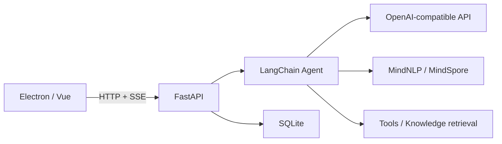

# MindPilot

Desktop agents with local models, knowledge retrieval and a live execution timeline.

[English](README.md) · [中文](README-zh.md)


This example follows a long-running task: checking internal requirements, retrieving research and model documentation, calculating deployment budgets, resolving conflicting constraints and producing an acceptance checklist.

## Features

- **Desktop workspace**: Electron, Vue and TypeScript; agents, conversations, model profiles and knowledge bases.
- **Live execution**: SSE delivers model output, tool inputs, tool results and completion events. Connection failures appear in the conversation.
- **Shared agent execution**: online and local models use the same LangChain structured-chat agent and selected tools.
- **Local knowledge**: document loading, Chinese text processing, BM25 and vector retrieval, and SQLite conversation storage.
- **Tools**: knowledge search, arXiv, web search, calculator, shell, weather and Wolfram. Enable only the tools needed for a task.

## Architecture



## Run

Use Python 3.11 and Node.js 20. Start the backend and frontend in separate terminals.

```bash
git clone https://github.com/fanxing-6/MindPilot.git
cd MindPilot
python -m venv .venv
source .venv/bin/activate
python -m pip install -r requirements.txt
cd src/mindpilot
python main.py
```

Activate the virtual environment before installation (`source .venv/bin/activate` on macOS/Linux, `.venv\Scripts\Activate.ps1` in PowerShell). On macOS install `libmagic` using Homebrew; on Linux install the system `libmagic` package for document type detection.

```bash
cd Frontend
npx yarn@1.22.22 install --frozen-lockfile
npm run dev
```

The backend listens on `127.0.0.1:7861`. Open **模型配置** to create a model profile, then choose an agent and its tools. OpenAI-compatible profiles require an API base URL, model name and key.

## Local models

Install `requirements-local.txt` in a Python environment supported by MindSpore 2.4 and the target device. Select **Local** in model configuration.

For Linux x86_64 with Python 3.11, install the official MindSpore wheel first:

```bash
python -m pip install https://ms-release.obs.cn-north-4.myhuaweicloud.com/2.4.0/MindSpore/unified/x86_64/mindspore-2.4.0-cp311-cp311-linux_x86_64.whl
python -m pip install -r requirements-local.txt
```

Other devices require the matching official MindSpore 2.4.0 package. The desktop frontend can run on macOS; local inference requires a supported backend environment.

- Qwen2.5-Instruct: 0.5B, 1.5B, 3B, 7B, 14B, 32B and 72B.
- Qwen2.5-Coder-32B-Instruct and QwQ-32B-Preview.
- Existing MiniCPM-2B and Qwen2-0.5B profiles remain available.
- A local directory containing `config.json`, tokenizer files and weights can be entered in the model field.

The model catalog follows releases available by **December 8, 2024**. Qwen2.5-72B-Instruct is the largest general instruction model in this catalog; Coder and QwQ target coding and reasoning respectively.

Weights are loaded once and reused until the model changes. Generation is serialized to prevent concurrent model mutation. Chat history and agent tool results use the tokenizer chat template; `max_tokens` limits newly generated tokens. Local model responses appear after each generation; online streaming profiles also emit incremental text.

Set `MINDPILOT_LOCAL_DEVICE` to `CPU`, `GPU` or `Ascend` as supported by the installed MindSpore build. Set `MINDPILOT_LOCAL_DTYPE` to `float16`, `float32` or `bfloat16` for the device. A 72.7B model requires roughly 135.4 GiB for FP16 weights alone, plus KV cache and runtime memory; model selection does not provide quantization or automatic multi-device distribution.

For offline use, download the complete model beforehand and select its local directory. Web, arXiv, weather and Wolfram tools require network access.

## Configuration

External tool credentials are read from `BING_SEARCH_KEY`, `WEATHER_API_KEY` and `WOLFRAM_APPID`. Model credentials are saved in the local model profile. Shell tools execute with the backend user permissions.

## Development

```bash
python -m pip install -r requirements-test.txt
python -m pytest --basetemp=work/pytest -q
python -m compileall -q src
cd Frontend
npm test
npm run build
```

Tests cover model selection, generation settings, real Runnable/tool events, SQLite persistence and SSE handling. Desktop packaging commands are `npm run build:win`, `npm run build:mac` and `npm run build:linux`; the Python backend runs separately.

To regenerate the README illustration, run `npm run demo`, then `npx playwright install chromium` and `npm run screenshot` in another frontend terminal. The screenshot uses the Vue conversation component.

## License

[Apache License 2.0](LICENSE). Model weights retain their own licenses.
